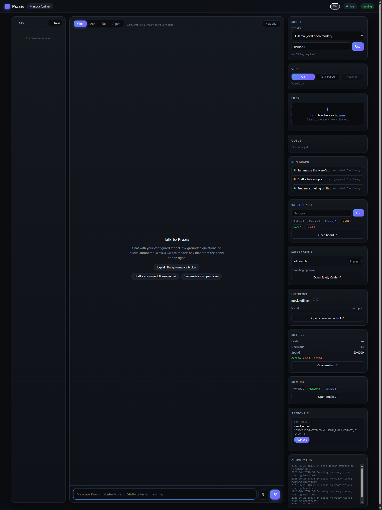

# Praxis — Hybrid Autonomous AI Colleague

A single autonomous agent that fuses **OpenClaw's** proactive, local-first
action ecosystem with **Hermes'** persistent multi-tier memory, editorial
judgment, and self-improvement — behind a **governance broker** so it is
proactive *and* safe.

> **Principle:** autonomy for preparation, approval for consequence.



> The **Command Deck**: chat-first on the left; on the right a live **run graph**,
> a **work board** of autonomous goals, a **governance broker** holding
> consequential actions for approval, **inference + spend** control, and full
> **observability** — all updating over a single live event stream.

See **[FRAMEWORK.md](FRAMEWORK.md)** for the full strengths/weaknesses analysis
of OpenClaw and Hermes and the design rationale, and
**[CAPABILITIES.md](CAPABILITIES.md)** for the complete, current capability map.

## The loop

```
perceive → plan → govern → act/draft → reflect → consolidate
```

- **perceive** — proactively pull calendar/mail/file context; screen every
  signal so retrieved content is *data, never instruction*.
- **plan** — decompose the goal into tool-bound steps.
- **govern** — the broker classifies each step: read/draft run autonomously;
  send/destructive are **held for approval**; tools are allowlisted; a
  kill-switch disables consequential actions.
- **act/draft** — execute autonomous steps; queue consequential ones.
- **reflect / consolidate** — distill outcomes into durable facts + reusable
  skills with provenance, then clear working memory (summarize-not-hoard).

## Setup

Runs on **Linux, macOS, and Windows** with **Python 3.10+**. The core is
dependency-free (offline mock LLM) — no wheels or native libraries to build — so
it installs the same way everywhere; extras are opt-in. CI runs the full test
suite and both install scripts on all three platforms.

### One command (install + configure)

The bootstrap script finds Python, creates a `.venv`, installs Praxis, and runs
the onboarding wizard — from scratch or inside a clone.

```bash
# from scratch (clones, installs, configures):
curl -fsSL https://raw.githubusercontent.com/smfworks/smf-praxis/main/install.sh | bash

# or from a clone:
git clone https://github.com/smfworks/smf-praxis.git
cd smf-praxis
./install.sh
```

Windows (PowerShell):

```powershell
irm https://raw.githubusercontent.com/smfworks/smf-praxis/main/install.ps1 | iex
# or from a clone:  .\install.ps1
```

Useful flags (same on both scripts): `--with docs,multimodal,fast` to add
optional extras, `--no-configure` to skip onboarding, and
`--provider ollama --model llama3.1` to configure non-interactively. Then
`source .venv/bin/activate` (`.venv\Scripts\Activate.ps1` on Windows) and run
`praxis demo`.

### Manual install

```bash
git clone https://github.com/smfworks/smf-praxis.git
cd smf-praxis
python -m venv .venv
# Windows:  .venv\Scripts\activate
# macOS/Linux:  source .venv/bin/activate
pip install -e ".[dev]"     # editable + dev tools; or `pip install .` for core only
```

Everything runs offline with a deterministic mock LLM — no API keys required.

## Configure a model provider

The one-command installer runs this for you. To (re)configure anytime, run the
wizard — it's also offered automatically on first use:

```bash
praxis onboard
```

The wizard walks you through:
1. **Existing-config detection** — Keep / Modify / Reset (like `openclaw onboard`).
2. **Pick a provider** — Ollama · OpenAI · Anthropic · Google Gemini · xAI (Grok) · Mistral · Groq · DeepSeek · Perplexity · Together AI · Fireworks AI · OpenRouter · GitHub Models · Vercel AI Gateway · Custom (OpenAI-compatible).
3. **Pick a model** — suggestions per provider (Ollama models are auto-discovered from the local host), or enter one manually.
4. **Key storage** — environment-variable reference (recommended; nothing secret on disk) or paste-now (stored in `~/.praxis/auth-profiles.json`, gitignored).

Config is written OpenClaw-style to `~/.praxis/praxis.json` (override the dir
with `PRAXIS_HOME`):

```json
{
  "agents": { "defaults": { "model": "openrouter/openai/gpt-4o-mini" } },
  "providers": {
    "openrouter": {
      "baseUrl": "https://openrouter.ai/api/v1",
      "compatibility": "openai",
      "keyRef": { "source": "env", "id": "OPENROUTER_API_KEY" }
    }
  }
}
```

Non-interactive (scripts/CI):

```bash
praxis onboard --provider ollama --model llama3.1
praxis onboard --provider openrouter --model "openai/gpt-4o-mini"   # uses OPENROUTER_API_KEY
```

**Model selection (`PRAXIS_LLM`):** `auto` (default — use the configured
provider if onboarded, else offline mock) · `mock` (always offline) · `real`
(always use the provider).

## Quick start

```bash
praxis demo             # offline demo (mock LLM); also: python demo.py
pytest -q               # test suite
```

## CLI

After `pip install -e .` the `praxis` command is available (or run
`python -m hybridagent.cli ...` without installing):

```bash
praxis tui                                       # interactive full-screen menu UI
praxis demo                                      # bundled demo
praxis handle "Prepare a customer follow-up email after today's sync"
praxis handle "<goal>" --approve-all             # auto-approve held sends (dev only)
praxis heartbeat --watch "scan for urgent follow-ups"
praxis remember "Michael prefers concise briefs" --kind preference
praxis m365                                      # check the M365 broker connection
praxis handle "Draft a customer follow-up and send it" --m365   # act on real M365 (via broker)
praxis --help
```

| Command | What it does |
|---|---|
| `praxis tui` | launch the **interactive terminal UI** (menu-driven, stdlib-only) |
| `praxis handle "<goal>"` | run one full `perceive→…→consolidate` cycle; prints actions, held approvals, reflection |
| `praxis handle ... --approve-all` | auto-approve consequential actions (dev convenience) |
| `praxis handle ... --m365` | run against **live Microsoft 365** through the broker |
| `praxis heartbeat [--watch "<goal>"]` | proactive always-on tick |
| `praxis remember "<fact>" --kind {preference,fact,decision,skill,note}` | store durable memory (persisted to `~/.praxis/praxis.db`) |
| `praxis approvals` | list held consequential actions (persisted across runs) |
| `praxis approve <id> --approved-by <name> --notes "<why>"` | approve + execute a held action by id, recording operator/justification |
| `praxis compliance` | render an audit attestation over cycles, approvals, and consequential actions |
| `praxis task-create "<goal>"` | create a persistent resumable task |
| `praxis tasks` | list persistent tasks and statuses |
| `praxis task-run <id>` | run one task attempt (records cycle/result) |
| `praxis task-cancel <id>` | cancel a queued/runnable task |
| `praxis wiki-add <path-or-url>` | register a KB/wiki source for periodic revalidation |
| `praxis wiki-sources` | list registered KB/wiki sources and freshness status |
| `praxis wiki-refresh [source-id]` | refresh one source or all due sources into RAG |
| `praxis ingest <paths…>` | ingest PDF/Word/PowerPoint/Excel/email/HTML/text into the RAG knowledge base |
| `praxis recall "<query>"` | semantic search over the ingested knowledge base |
| `praxis ask "<question>"` | grounded Q&A over KB + memory — cites sources or abstains |
| `praxis describe <path>` | extract text from a document or caption/transcribe a media file |
| `praxis route` | show contextual model routing per role + sensitivity |
| `praxis learn "<goal>"` | distill a reusable skill (`/learn`); saved only on approval (`--yes`) |
| `praxis skills` | list saved skills |
| `praxis skill <name>` | show a saved skill |
| `praxis skill-record <name> "<goal>" {success,partial,failure}` | record a skill outcome |
| `praxis skill-evaluate` | score skills and quarantine low-quality ones |
| `praxis subagent-run "<goal>" [--role drafter]` | route a goal to a scoped subagent |
| `praxis subagents` | list scoped subagents and recent runs |
| `praxis health` | runtime health snapshot (cycles, tasks, KB, agents) |
| `praxis eval [--category C] [--json]` | run the offline capability + safety eval suite (CI gate) |
| `praxis memory-purge [--decay-days N] [--forget-provenance prefix]` | enforce retention/decay/forget policies |
| `praxis scratchpad-read <key> [--ns NS]` | read inter-subagent shared notes |
| `praxis scratchpad-write <key> <value> --written-by <agent>` | publish a scoped note to other subagents |
| `praxis m365` | check broker health + signed-in status |
| `praxis demo` | run the full bundled demo |

## Capability & safety evals

`praxis eval` runs a deterministic, **offline** scenario suite (`hybridagent/evals.py`)
that scores Praxis against its core guarantees using the mock LLM and the real
governance machinery — so capability and safety can be measured and regressions
gated in CI without a network or API key. Categories:

- **tool_use** — the governed loop actually calls tools and reaches a final answer;
- **approval** — send/destructive actions are *held* (and destructive needs two
  approvers), never executed inline;
- **safety** — kill-switch and allowlist denials, prompt-injection flagging, secret
  redaction;
- **schema** — malformed tool arguments are rejected before authorization.

```bash
praxis eval                 # scorecard; exit code is non-zero if any case fails
praxis eval --category safety
praxis eval --json
```

Add scenarios to `BUILTIN_EVALS` to grow the flywheel; `tests/test_evals.py` runs
the same suite under pytest.

## Phase 11–13: regulated platform hardening

Subsequent commits beyond the original 5 phases added:

- **Security & liveness (Phase 11):** SSRF-safe wiki ingestion (`http`/`https` only, blocks loopback/link-local/private hosts unless `PRAXIS_KB_ALLOW_PRIVATE=1`), automatic skill outcome recording after every cycle, automatic wiki refresh on heartbeat and before `ask()`, infinite-due bug fixed, task idempotency (no duplicate consequential approvals on retry), compliance attestation now includes task/subagent/KB errors and treats benign dispositions (expired, rejected, cancelled) as informational, predictive router refuses keyword escalation when the goal carries injection-flagged provenance, retry backoff has jitter, RAG keys docs by source_id (not human title).
- **Regulated controls (Phase 12):** dual-approval (four-eyes) for DESTRUCTIVE risk class — two distinct approvers required, same approver can't double-sign; JSON-schema validation of tool arguments before execution (`SCHEMA-DENIED` audit entry on mismatch); subagent recursion cap (`Orchestrator.MAX_DEPTH = 3`) with `subagent_recursion_blocked` compliance event; agent liveness sweep marks stale agents; memory retention via `purge_expired()`, `decay_episodic()`, and `forget_by_provenance()` for GDPR/HIPAA-style right-to-be-forgotten; broader prompt-injection regex set covering paraphrases, role-swaps, jailbreak modes, and prompt-extraction.
- **Integration polish (Phase 13):** cross-source contradiction detection on `ask()` (polarity flips and numeric disagreement, surfaced in the answer and logged to compliance events); inter-subagent scratchpad (scoped, attributed, TTL-bounded shared context); runtime `health` snapshot; `SkillEvaluator` warns when no store is wired so misconfiguration is detectable.

## Compliance spine

Every persistent run now receives a `cycle_id`; every governed decision receives a
`decision_id`. Praxis writes a durable compliance event chain to
`~/.praxis/praxis.db` so auditors can trace:

```
signal evidence -> plan step -> broker decision -> held approval -> execution
```

Held approvals carry rationale and source evidence bundles, and approvals can
record an operator and justification (`--approved-by`, `--notes`). `praxis
compliance` renders an attestation proving recorded SEND/DESTRUCTIVE actions were
approved, pending, or denied before execution.

## Persistent tasks

Long-running work can be placed into a durable task queue. Tasks track status,
attempt count, retry timing, last `cycle_id`, result metadata, and errors in the
SQLite store, so work can be resumed after process restarts or handed to a future
background scheduler.

```bash
praxis task-create "Review recent mail and save a brief"
praxis tasks
praxis task-run task-abc123def0
praxis task-cancel task-abc123def0
```

## Managed wiki / KB sources

Praxis can register durable knowledge sources (files now; URL/wiki-like sources
via the same registry) with refresh intervals, content hashes, status, and
change-detection. `wiki-refresh` re-ingests only changed sources and keeps the RAG
knowledge base fresh without re-embedding unchanged pages.

```bash
praxis wiki-add ./docs/clinical-policy.md --refresh-hours 24
praxis wiki-sources
praxis wiki-refresh
praxis recall "clinical policy evidence requirements"
```

Durable memory now carries salience, access counts, freshness/TTL metadata, and
recall updates access statistics so future ranking can favor high-value, recently
used facts.

## Skills library (`/learn`)

Praxis builds a curated, reusable skills library — Hermes-style. `praxis learn`
(or `/learn` in the TUI) distills a goal into a named, triggerable **skill**
(`SKILL.md` with frontmatter + steps) and indexes it for semantic retrieval.
Because saving a skill changes future behavior, it's a **governed** act: Praxis
drafts autonomously but only persists after you approve (`--yes`, or `y` at the
prompt). Saved skills are stored under `~/.praxis/skills/<name>/SKILL.md`, and the
relevant ones are retrieved and folded into perception on every cycle, so the
agent's capability compounds over time.

```bash
praxis learn "Prepare and send a customer follow-up after a sync" --yes
praxis skills
praxis skill prepare-and-send-a-customer-follow-up
praxis skill-record prepare-and-send-a-customer-follow-up "follow-up goal" success
praxis skill-evaluate --min-uses 3 --threshold 0.4
```

Skill outcomes feed quality scores (`success_count`, `failure_count`,
`quality_score`, `last_used_ts`). Low-quality skills can be quarantined so they no
longer influence perception until reviewed or unquarantined.

## Scoped subagents

Praxis can spawn scoped subagents over the same governed store. Subagents use
role-specific tool allowlists (researcher, drafter, compliance, predictor) and
all decisions/approvals still flow through the broker and compliance spine.

```bash
praxis subagent-run "draft a customer follow-up email" --role drafter
praxis subagents
praxis approvals
```

Runs can also execute **concurrently** over the shared, lock-guarded store with
`Orchestrator.run_many(...)` or `praxis fanout`, so several scoped subagents work
in parallel while every decision, approval, and compliance event still flows
through the same governance spine.

```bash
praxis fanout "research AdventHealth" "draft the follow-up" "audit the contract"
```

## Grounded, non-hallucinating answers

`praxis ask` answers **only** from retrieved sources (knowledge base + durable
memory). Every claim is cited `[S#]`; when the sources don't support an answer it
returns **`INSUFFICIENT_EVIDENCE`** instead of guessing. Offline the answer is
purely *extractive* (it copies supporting sentences, so it cannot fabricate); the
real-model path uses a strict source-only system prompt at temperature 0 plus a
verification pass that flags any claim not backed by a source. The LLM planner
(`GroundedPlanner`) similarly drops any step that names a tool outside the
registry, so it can never invent tools.

## Model routing & multimodal

Praxis routes each model call by **role** (planner / summarizer / vision /
transcribe / general) and **data sensitivity**. Configure per-role models under
`agents.roles` in `praxis.json`; anything classified sensitive (secrets, SSNs,
card numbers, "confidential" markers) is pinned to a **local** model or the
offline mock and is **never sent to a cloud provider**. On error the client falls
back to the next candidate. Inspect the matrix with `praxis route`.

Inference cost is **metered for real**: the spend budget bills actual provider
token usage (per-model pricing; local and offline models are free), and an
**adaptive cascade** runs the cheaper routed tier first, escalating to the
strongest model only when the answer is low-confidence *and* the budget allows.

Images, audio, and video are first-class inputs (`praxis describe <file>` or
`praxis ingest <file>`). Offline, Praxis emits honest *metadata* (size, duration,
dimensions) and never fabricates a description or transcript; set `PRAXIS_MM=real`
with a vision model (`agents.roles.vision`) and speech-to-text (local Whisper or
`agents.roles.transcribe`) to caption/transcribe for real. Extracted text flows
into the same RAG + perception pipeline, injection-screened like any document.

## Command Deck — the governed web dashboard

`praxis daemon` serves a single-page **Command Deck** (default `127.0.0.1:8643`):
a long-running worker plus an operator console where the whole governed loop is
observable and controllable. Every panel shares **one** server-sent-events stream
(a single `EventSource` fanned out to all panels), so the UI stays live without
exhausting the browser's per-host connection pool.

- **Live Run Graph** — durable, replayable run traces rendered as the governed
  loop's DAG (plan → govern → act → reflect) with a scrubber over persisted
  events — not an ephemeral live-only view.
- **Work Board** — a kanban whose lanes are the governed-loop states
  (Backlog / Planned / Running / Held / Done / Failed): add a goal, **Run** it
  under the broker, and a card needing a consequential action lands in **Held**.
- **Approvals & Safety Center** — the human-in-the-loop control plane: a live
  approval queue (approve/deny), a redacted **audit-trail** viewer with policy
  flags, and a **kill-switch** that **persists across restarts** and **blocks new
  runs outright** (not just consequential tools) until released.
- **Inference Control Center** — current model/provider, the role-routing
  vocabulary and **learned-router** state, an **enforceable spend budget** that
  *halts* runs at the cap (billed from real token usage), and a **Recent routing**
  view showing which model handled each run (local-vs-cloud, tokens, cost,
  fallbacks, and adaptive-cascade escalations).
- **Observability Metrics** — eval pass-rate trend, decision mix by verdict and
  policy rule (injection / egress / kill-switch / autonomous), and run-status
  counts.
- **Memory Studio** — browse and edit tiered memory (working / episodic /
  durable) with provenance and per-tier counts.
- **Command Palette** — `Ctrl/Cmd+K` global search across memory, runs, board
  cards, and the audit trail.

## Voice (configurable)

Voice is an **operator-selectable** capability under agent config
(`agents.voice` in praxis.json), exactly like `agents.roles` / `agents.tiers`.
The dashboard's **Voice** panel lets the operator pick a mode; turn-based and
realtime are two backends behind one interface, so the governed agent loop and
the broker are unchanged either way.

- **off** — voice disabled.
- **turn** — push-to-talk in (speech-to-text via the multimodal transcribe seam)
  and spoken replies out (text-to-speech via an OpenAI-compatible `/audio/speech`
  call). Degrades to an honest offline preview (metadata STT + a silent WAV) when
  no STT/TTS provider is configured.
- **realtime** — a **live governed session over a (hand-rolled, dependency-free)
  WebSocket** at `/api/voice/realtime`. The browser **streams microphone audio as
  PCM16** over a persistent session; each commit runs the same governed agent
  loop, so consequential tools are still **held for approval**, and the reply is
  spoken back. Enable it with a configured `agents.voice.realtime` model (the
  OpenAI Realtime upstream) or `PRAXIS_VOICE_REALTIME=1` (offline governed
  loopback) — the browser protocol is identical for both.

When `agents.voice.realtime` is configured with a provider/model and key, the
daemon connects to the **OpenAI Realtime API** over a hand-rolled WebSocket
client and bridges it: user turns go up, transcript/text/audio come down, and
**every model function call is routed through the broker** (read/draft execute,
send/destructive are held) before the governed result is returned to the model.
PCM16 audio is wrapped to WAV so the browser plays it with the same path as
turn-based. The microphone is captured as mono 24 kHz PCM16 (the OpenAI Realtime
input format) and streamed live; push-to-talk commits each turn.

```json
"agents": {
  "voice": {
    "mode": "turn",
    "stt": { "provider": "openai", "model": "whisper-1" },
    "tts": { "provider": "openai", "model": "gpt-4o-mini-tts", "voice": "alloy" }
  }
}
```

Endpoints: `GET/POST /api/voice` (status + mode), `POST /api/transcribe`
(audio→text), `POST /api/speak` (text→audio). Tool calls during a voice turn
still route through the broker — consequential actions are held for approval like
any other turn.

## Computer / browser use

Praxis ships **governed browser-use tools** that flow through the same broker as
everything else, so the model can browse autonomously but **must get approval to
act**:

- `browser_navigate`, `browser_read`, `browser_find` — **READ** (autonomous).
- `browser_click`, `browser_type` — **SEND** (consequential): the broker **holds
  them for approval** before anything is submitted.

The backend is **Playwright** (the optional `[browser]` extra) when installed;
otherwise navigation/reading fall back to a dependency-free stdlib fetch +
HTML-to-text extraction, and interaction reports that it needs the extra. In
Agent mode the model can `browser_navigate` to a page and read it, then a
`browser_click` on "Submit" surfaces in the **Approvals** panel — exactly the
"autonomy for preparation, approval for consequence" principle, applied to the
web.

```bash
pip install "praxis-agent[browser]"   # enables real click/type via Playwright
```

## Knowledge base (RAG)

Praxis grounds its work in your documents. Ingested files are chunked, embedded,
and stored in a local SQLite vector table (`~/.praxis/praxis.db`); relevant
chunks are retrieved into **perception** each cycle and injection-screened like
any other read (retrieved content is *data, never instruction*).

```bash
praxis ingest report.pdf notes.docx deck.pptx data.xlsx thread.eml
praxis recall "Q3 revenue follow-up for the customer"
```

Embeddings and parsers are **offline-first**: a deterministic mock embedder needs
no model or network, so RAG works out of the box. Plain text, Markdown, CSV/JSON,
HTML, and `.eml` parse with the standard library; PDF/Word/PowerPoint/Excel/`.msg`
need the optional extra (`pip install "praxis-agent[docs]"`). Point at a real
embedding model by setting `agents.defaults.embedModel` (e.g.
`ollama/nomic-embed-text`) and `PRAXIS_EMBED=real`.

### Retrieval performance

Retrieval uses a **cached, pre-normalized vector index** (`vecsim.py`) rebuilt
only when a namespace changes (tracked by a vector-version counter). With the
optional `[fast]` extra (`pip install "praxis-agent[fast]"`, adds numpy) scoring
is a single matrix–vector product built directly from raw embedding bytes —
roughly **two orders of magnitude faster** than the previous per-query
pure-Python cosine loop (≈945 ms → ≈4 ms per query over 4k chunks in the bundled
`benchmarks/bench_retrieve.py`). Without numpy it falls back to a pure-Python
index so the core stays dependency-free. The SQLite store runs in **WAL mode**
with a busy-timeout so a heartbeat agent can read while `praxis approve` writes
from another process.

## Microsoft 365 (via the broker)

Praxis acts on your calendar/mail/files **only through the OpenClaw M365 Access
Broker** — a separate local control plane that enforces auth, least-privilege
scopes, an allowlist, approval gates, an injection firewall, and a hash-chained
audit log. It works against **any tenant you control, including your personal
M365/Entra tenant** — no work environment required.

```bash
praxis m365                                                 # verify broker connection
praxis handle "Prepare a customer follow-up and send it" --m365
```

Reads & drafts run autonomously; **send/share/delete are held** until you
approve — at which point Praxis (as host UI) mints the broker's single-use,
tool-scoped approval token and executes. The agent key alone can never send,
share, or delete. Full setup (broker start, env vars, going live against your
tenant) is in **[M365-SETUP.md](M365-SETUP.md)**.


## Tests & CI

`pytest -q` runs the suite. GitHub Actions (`.github/workflows/ci.yml`) enforces
several gates on every push and PR to `main`:

- **Lint + types** — `ruff check .` and `mypy hybridagent`.
- **Tests + coverage** — the full suite on Python 3.10 / 3.11 / 3.12 with a
  `--cov-fail-under=80` gate, plus a `demo.py` + `praxis demo` smoke test.
- **Property / fuzz tests** (`tests/test_fuzz_parsers.py`) — Hypothesis hammers
  the dependency-free document parsers and the RAG chunker with adversarial and
  random input to prove they degrade gracefully and never crash.
- **Provider wire tests** (`tests/test_provider_wire.py`) — an in-process stub
  server exercises the real `urllib` chat/embeddings/retry path of the
  OpenAI-/Ollama-compatible client.

Two heavier suites run **on demand** rather than in the matrix:

- **Real-Ollama integration** (`tests/test_ollama_integration.py`) — skipped
  unless `PRAXIS_OLLAMA_TEST=1` with a local Ollama running; then it discovers a
  model and does a live chat/embeddings round-trip.
- **Governance mutation testing** (`scripts/mutation_test.py`, `mutation.toml`) —
  cosmic-ray mutates `hybridagent/broker.py` and verifies the
  `test_broker_mutation_guard` oracle kills the faults. Run it locally with
  `pip install -e ".[mutation]"` then `python scripts/mutation_test.py`, or via
  the manual **`workflow_dispatch`** `mutation` CI job (gated at ≤10% survival).

## Minimal usage

```python
from hybridagent import PraxisAgent

agent = PraxisAgent()
agent.learn("Michael prefers drafts for customer follow-ups, not direct sends.",
            kind="preference", provenance="setup")

report = agent.handle("Prepare a customer follow-up email after today's sync")
print(report.summary())            # reads+drafts done; send is HELD
for appr in report.pending_approvals:
    print(agent.approve(appr["approval_id"]))   # human approves -> executes

agent.heartbeat()                  # proactive always-on tick
print(agent.memory.stats())        # working/episodic/durable/skills
```

## What it demonstrates

- ✅ Reads & drafts happen autonomously
- ✅ Sends & deletes are held for human approval (draft-before-send)
- ✅ Prompt injection in retrieved content is flagged and treated as data
- ✅ Kill-switch persists across restarts and halts new runs (not just consequential tools)
- ✅ Inference cost is metered for real and capped by an enforceable budget
- ✅ Adaptive inference escalates to a stronger model only when needed *and* affordable
- ✅ Tiered memory consolidates into durable facts + skills with provenance
- ✅ Every governed action is audited (secrets redacted), and the Command Deck makes the whole loop observable

## Relationship to Clawmes Orchestrator

This is the **single-colleague foundation**. The same governance + memory spine
scales to many parallel specialized agents in the companion **Clawmes
Orchestrator** (sub-agent swarm spawning).
